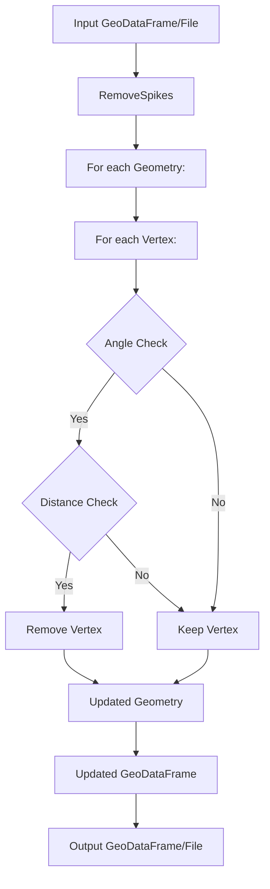

# remove-spikes

**remove-spikes** is a simple tool designed to clean up your spatial data by removing spikes from lines and polygons in GeoDataFrames and various GIS formats.
It achieves this by eliminating vertices that form angles smaller than a defined threshold and, optionally, those that are a minimum distance apart from their neighboring vertices.
This can greatly improve the quality of your spatial data for further analysis and visualization.

## Table of contents

- [Instalation from Source](#instalation-from-source)
- [Python Usage](#python-usage)
- [CLI Usage](#cli-usage)

## Instalation from Source

To get started with **remove-spikes,** you can install it directly from the source.
Follow these steps:

### Standard Installation

```sh
git clone https://github.com/pahbloo/remove-spikes.git
cd remove-spikes
pip install .
```

### Installation for CLI Usage

For command-line interface (CLI) usage, [pipx](https://pipx.pypa.io/) is recommended to ensure an isolated environment:

```sh
git clone https://github.com/pahbloo/remove-spikes.git
cd remove-spikes
pipx install .
```

## Basic Python Usage

Integrating **remove-spikes** into your Python workflow is straightforward.
Here's how you can use it:

```py
from removespikes import RemoveSpikes

# To remove spikes from a file
gpd = RemoveSpikes.from_file("data.gpkg", angle=1)

# To remove spikes from a GeoDataFrame
new_gpd = RemoveSpikes.from_geodataframe(spiky_gpd, angle=1)
```

For a comprehensive list of options and more detailed usage instructions, please refer to the [full documentation]().

## Basic CLI Usage

For those who prefer using the command line, **remove-spikes** offers a convenient CLI:

```sh
remove-spikes --input data.gpkg --angle 1 --output without-spikes.gpkg
```

To see all available options and get help with usage, simply run:

```sh
remove-spikes --help
```

## How does it work? (Flowchart)

